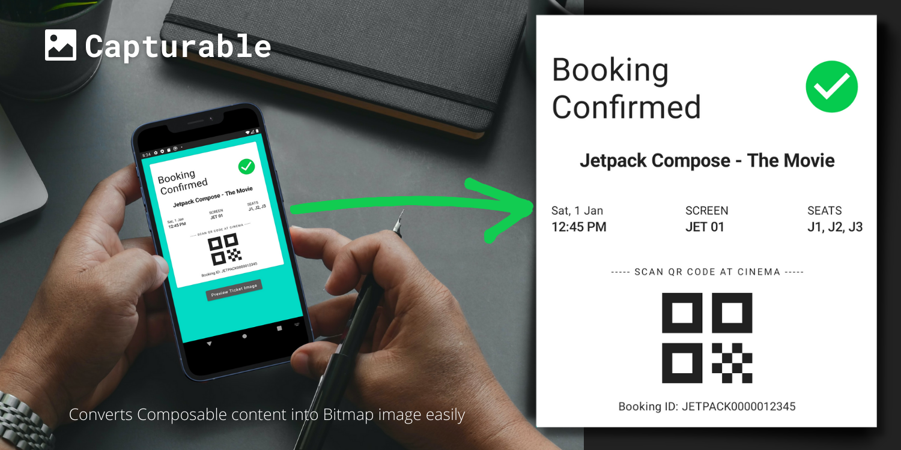

# Capturable



🚀A Jetpack Compose utility library for converting Composable content into Bitmap image 🖼️.  
_Made with ❤️ for Android Developers and Composers_ 

[](https://github.com/PatilShreyas/Capturable/actions/workflows/build.yml)
[](https://search.maven.org/artifact/dev.shreyaspatil/capturable)

## 💡Introduction 

In the previous View system, drawing Bitmap Image from `View` was very straightforward. But that's not the case with Jetpack Compose since it's different in many aspects from previous system. This library helps easy way to achieve the same results.

## 🚀 Implementation

You can check [/composeApp](/composeApp) directory which includes example application for demonstration. 

### Gradle setup

In `lib.versions.toml`  include this dependency version catalog

```toml
[versions]
capturable = "3.0.0"

[libraries]
capturable = { id = "dev.shreyaspatil:capturable", version.ref = "capturable" }
```

```kotlin
dependencies {
    implementation(libs.capturable)
}
```

or In `build.gradle` of app module, include this dependency

```gradle
dependencies {
    implementation "dev.shreyaspatil:capturable:3.0.0"
}
```

_You can find latest version and changelogs in the [releases](https://github.com/PatilShreyas/Capturable/releases)_.

### Usage

#### 1. Setup the controller

To be able to capture Composable content, you need instance of [`CaptureController`](https://patilshreyas.github.io/Capturable/capturable/dev.shreyaspatil.capturable.controller/-capture-controller/index.html) by which you can decide when to capture the content. You can get the instance as follow.

```kotlin
@Composable
fun TicketScreen() {
    val captureController = rememberCaptureController()
}
```

_[`rememberCaptureController()`](https://patilshreyas.github.io/Capturable/capturable/dev.shreyaspatil.capturable.controller/remember-capture-controller.html) is a Composable function._

#### 2. Add the content

The component which needs to be captured, a `capturable()` Modifier should be applied on that @Composable component as follows.

```kotlin
@Composable
fun TicketScreen() {
    val captureController = rememberCaptureController()

    // Composable content to be captured.
    // Here, everything inside below Column will be get captured
    Column(modifier = Modifier.capturable(captureController)) {
        MovieTicketContent(...)
    }
}
```

#### 3. Capture the content

To capture the content, use [`CaptureController#captureAsync()`](https://patilshreyas.github.io/Capturable/capturable/dev.shreyaspatil.capturable.controller/-capture-controller/captureAsync.html) as follows. 

```kotlin
// Example: Capture the content when button is clicked
val scope = rememberCoroutineScope()
Button(onClick = {
    // Capture content
    scope.launch {
        val bitmapAsync = captureController.captureAsync()
        try {
            val bitmap = bitmapAsync.await()
            // Do something with `bitmap`.
        } catch (error: Throwable) {
            // Error occurred, do something.
        }
    }
}) { ... }
```

On calling this method, request for capturing the content will be sent and `ImageBitmap` will be 
returned asynchronously. _This method is safe to be called from Main thread._

## 📄 API Documentation

[**Visit the API documentation of this library**](https://patilshreyas.github.io/Capturable) to get more information in detail.

---

## 🙋‍♂️ Contribute 

Read [contribution guidelines](CONTRIBUTING.md) for more information regarding contribution.

## 💬 Discuss? 

Have any questions, doubts or want to present your opinions, views? You're always welcome. You can [start discussions](https://github.com/PatilShreyas/Capturable/discussions).

## 📝 License

```
MIT License

Copyright (c) 2022 Shreyas Patil

Permission is hereby granted, free of charge, to any person obtaining a copy
of this software and associated documentation files (the "Software"), to deal
in the Software without restriction, including without limitation the rights
to use, copy, modify, merge, publish, distribute, sublicense, and/or sell
copies of the Software, and to permit persons to whom the Software is
furnished to do so, subject to the following conditions:

The above copyright notice and this permission notice shall be included in all
copies or substantial portions of the Software.

THE SOFTWARE IS PROVIDED "AS IS", WITHOUT WARRANTY OF ANY KIND, EXPRESS OR
IMPLIED, INCLUDING BUT NOT LIMITED TO THE WARRANTIES OF MERCHANTABILITY,
FITNESS FOR A PARTICULAR PURPOSE AND NONINFRINGEMENT. IN NO EVENT SHALL THE
AUTHORS OR COPYRIGHT HOLDERS BE LIABLE FOR ANY CLAIM, DAMAGES OR OTHER
LIABILITY, WHETHER IN AN ACTION OF CONTRACT, TORT OR OTHERWISE, ARISING FROM,
OUT OF OR IN CONNECTION WITH THE SOFTWARE OR THE USE OR OTHER DEALINGS IN THE
SOFTWARE.
```
